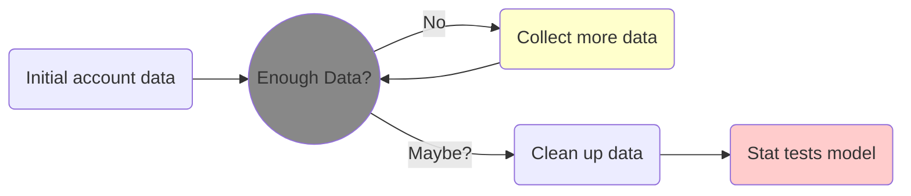

# What is Valorant?
Valorant is a 5v5 character-based tactical FPS where precise gunplay meets unique agent abilities. 

Normal tactile shooters incorporate the importance of:
1. aiming precisely and accurately at enemy teammates with emphasis on headshots
2. team strategy to either plant or defuse the bomb (spike)
3. team synergy to either kill someone together or trade off kills, or use your numbers advantage later in the round
4. the economy of each team to figure out what kind of guns they can buy for a given round. 
   - Teams usually have different strategies based on the guns they have vs what their opponents have.

Valorant is special because it adds characters with unique abilites. Games that do this usually have imporance on:
1. different ability combinations between teammates
2. different characters having different abilities have different roles on the team:
   - who entires, who assists with that, who smokes off points, who flanks, etc.
3. the 'ultimate' (ult) economy, the ult being a special ability you acquire through playing some number of rounds. 
   - Teams can have completely different strategies depending on the ults available.

Combining both means there's many different player stats to look at, and a game can be strategically complex.

## Valorant has a 'smurfing' problem
Valorant, like any other online game, has a smurfing problem. Cheating is when a player utilizes external software to help them at a higher ability for the sake of rank/glory. Smurfing is essentially the opposite problem, a player create new accounts for the sole purpose of playing people signifcantly worse than them. This can ruin the game for the rest of the players who are trying to play fairly. Valorants anti-cheat software will improve over time, but it has no ability to detect smurfs.

## Can we do something about the smurfing problem?
There are many statistics in the game. The better players are better for some reason. The reason better players are better could be a whole list of things:
- more accurate at shooting 
- kill opponents more often and die fewer times in a game
- assists teammates more frequenty 
- use their abilities more effectively
- etc. 
I wanted to see how these can be translated into in-game statistics and how much better a higher ranked player is at each. Then are the differences statistically significan to distinguish player ranks. I will also take into account the type of character someone normally plays to see if this changes the statistics. I want to create a model that predict a player's rank (with some confidence level) based on their in-game statistics.

--------------------------------------------------------------------------------------------------------------------------------------------------------------

# Current Progress

## 1. Acquire a large list of accounts statistics
With the help of an [API](https://github.com/Henrik-3/unofficial-valorant-api) by Henrik-3, I have written a recursive program that collects accounts from some seeded players. A list of accounts does not already exists, so I have to check the last five matches/games of a player, add any enemies/teammates that are already not in my list, and if I haven't reached the max depth yet, run the algorithm on that group of people. I have acquired over 250,000 accounts. Afterwards, I collect player statistics for each account in that list. Some accounts have no data associated with them for one of several reasons. After cleaning the data, I have about 150,000 accounts left with statistics.

The current distribution of players I have is found below.

Which is not too different from the distribution found on [tracker.gg](https://tracker.gg/valorant/leaderboards/ranked/all/default?page=1). 

## 2. Clean data and find average stats with uncertainty for each rank

After removing the accounts with missing data, I should remove the accounts that are statistical outliers in their given rank. These accounts are potentially smurfs, or accounts where the players have recently gotten better, but have not ranked up yet. I want to remove this data as including them would skew the average stats for each rank.

From here I actually found some interesting results. Firstly, the statistics I saved were kill/death ratio (KD), number of assists, headshot percentage, and number of times an ability was used. These were all averaged to one match. I found that KD and assists leveled out pretty quickly in the mid tiers. However, headshot percentage and ability usage roughly linearly increased given the players rank:

 

 

I also wanted to track these stats based on the position someone plays, which is mostly dependent on the class of agent they play. A player can pick characters (agents) from four classes: duelist, initiator, sentinel, and controller. Each class has a different set of responsibilies they are supposed to preform during a game. However, at lower ranks, these system isn't followed very much. The fifth group below is labeled as a 'flex' player, which is someone that doesn't consistently play a character from one of the four groups listed above. I found that the graphs which are just based off rank do not change much when considering character type:

The only graph that changes considerably is assists per game. However, Valorant calculates assists in a very strange way, and you can get 'non-damaging' assists in a lot of different ways, and Riot is not totally transparent on their in game algorithms for specific calculations. 

I think when I create the tests/model, I need:
- heavier emphasis on headshot percentage and ability usage, 
- much less importance on KD, and 
- almost ignore assists. 
- It also seems that I do not need to take character type into account

## 3. Creating a model to determine if someones stats and rank make up (within some Confidence)
I am thinking of using a couple t-tests (or z-tests) or create a k nearest neighbor (KNN) model to compare the alleged smurf accounts average statistics to that of the for their given rank. I am hoping the confidence level will be significant, and it may not be perfect, but I am hoping it gives a good starting point.

--------------------------------------------------------------------------------------------------------------------------------------------------------------

# Software
The code is comprised of Python (.py) files as well as Jupyter notebooks. The main packages in use are pandas, matplotlib, requests, and numpy.

All .py files are essentially libraries/method holders so the Jupyter notebooks are not so cluttered:

| File                            | What does it do?     |
| -----------------------------   | -------------:|
| Scrap Account Data              | Jupyter notebook that collects the account data from the different seeded accounts, exports to CSVs, merges all CSVs, and plots distribution of ranks | 
| FindMoreUsers.py                | main recursive function that calls MatchAndRankRequest.py to acquire account information and then adds new accounts to the set | 
| MatchAndRankRequest.py          | calls [API](https://github.com/Henrik-3/unofficial-valorant-api) to request account data | 
| AccountDataCollection.py        | averages account stats collect from MatchDataCollection.py |
| MatchDataCollection.py          | calculates kill/death ratio, headshot %, and number of abilites used per game | 
| Aggregate Statistics for Model  | Jupyter notebook that removes data with missing information, removes statistical outliers from each rank by calling ManipDFStats.py, and plots average account stats vs rank (and position) | 
| ManipDFStats.py                 | separates pandas dataframe into individual ones based on rank, removes statistical outliers, and concatas them back into one datafram | 

--------------------------------------------------------------------------------------------------------------------------------------------------------------

# Potential issues/future adjustments
1. Due to the API, I can only acquire the last 5 games for each account, which means their average statistics could be highly violatile. This could only be compensated for by saving everyone's information and updating it over time. I am not sure I have the space for this, and this would only work if I initially had a large number of user accounts that I didn't ever have to add to, those accounts consistantly played the game for years. However, if my 'seed' accounts continue to play, then getting a new set of 7000 accounts every couple weeks will hopefully keep all the average rank statistics pretty fair with the population that plays the game.

2. Currently, I only am including North American (NA) players. Different regions do not play with one another, and all my seed accounts are NA, and to find info for all the other accounts would take much longer as there's like 7-10 regions for Valorant.

--------------------------------------------------------------------------------------------------------------------------------------------------------------

